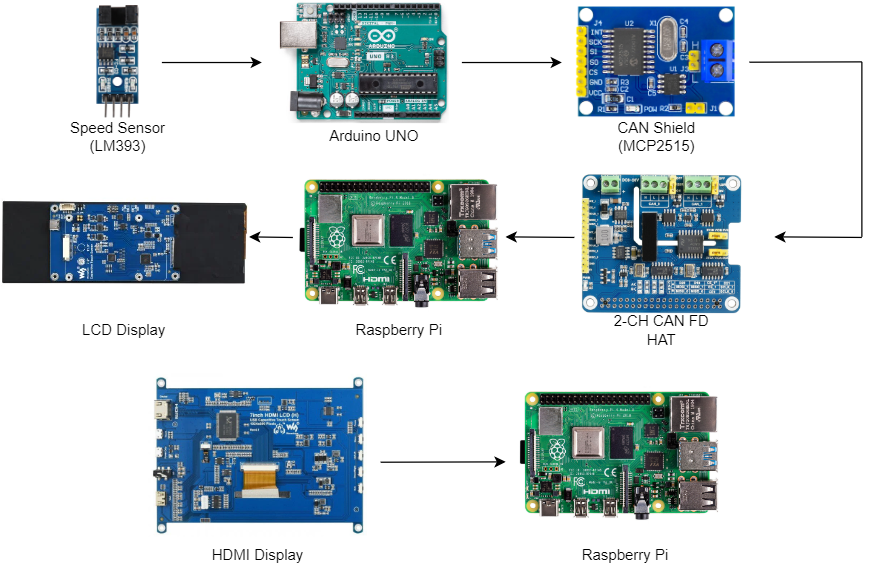
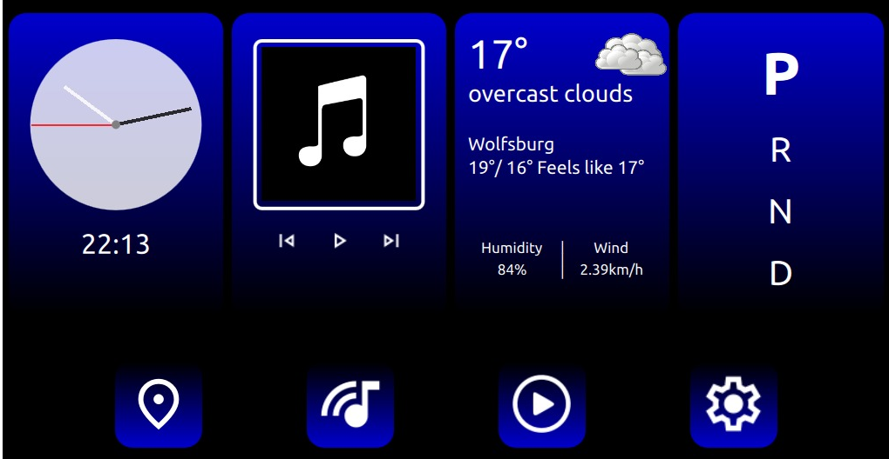

# DES Project - Head Unit
This project aims to develop a Head Unit Qt application running on a Raspberry Pi (RPi) alongside the previously developed PiRacer Instrument Cluster Qt application. The Head Unit application will provide additional features like ambient lighting, gear selection, and a media app.

## Goals and Objectives

1. Develop a robust and scalable head unit application for automotive use on Raspberry Pi
2. Integrate the application with the instrument cluster app and other vehicle systems through IPC (Inter-Process Communication) and CAN (Controller Area Network)
3. Implement ambient lighting control through the Head Unit application
4. Display of the current gear selection on the Head Unit GUI
5. Develop a media app, including functionality for playing and controlling music and videos

## Hardware Requirements
- PiRacer Kit
- Joystick
- Speed Sensor (LM393)
- Arduino UNO
- CAN Shield (MCP2515)
- 2-CH CAN FD HAT
- Raspberry Pi 4
- 7.9inch DSI LCD Display
- 7inch HDMI Display
- Jumper wires, USB cable for Arduino

## Hardware Connection

## Software Stack
1. Tools
    - Ras-pi Imager
    - Arduino IDE
    - Visual Studio Code
    - Qt Creator

2. Languages
    - Arduino Sketch
    - C++
    - Python
    - Qml

## Result
